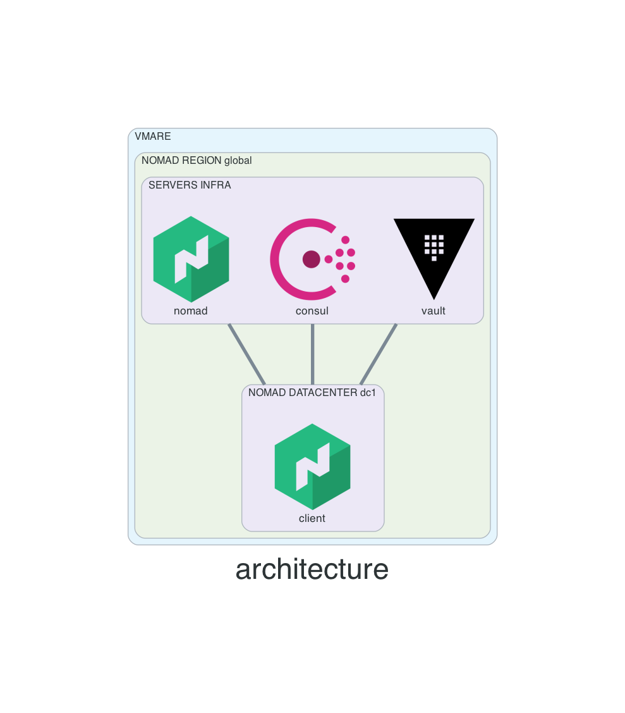

# nomad-vmware

[nomad architecture reference](https://learn.hashicorp.com/tutorials/nomad/production-reference-architecture-vm-with-consul?in=nomad/enterprise)


## Diagram


# How to use this repo
- clone the repo
```
git clone git@github.com:ion-onboarding/nomad-vmware.git
```

- change directory
```
cd nomad-vmware
```

## Create infrastructure
- initialize working directory
```
terraform init
```

- plan, to see what resources will be create
```
terraform plan
```

- create resources
```
terraform apply
```

## How to connect?
- use terraform output
```
terraform output
```

## Destroy infrastructure
- destroy resources
```
terraform destroy
```

# Server details

## Consul
- members
```
consul members
```

- raft peers
```
consul operator raft list-peers
```

## Vault
- GUI user password (root privilege)
```
username: admin
password: admin
```
- status
```
vault status
```

- login on the CLI
```
vault login -method=userpass username=admin password=admin
```

- export VAULT_TOKEN
```
export VAULT_TOKEN=<token>
```

- lookup token being used
```
vault token lookup
```

- servers (raft)
```
vault operator raft list-peers
```

## Nomad
- servers
```
nomad server members
```

- nodes
```
nomad node status
```

- raft peers
```
nomad operator raft list-peers
```

- test a job with nomad
```
nomad job run examples/redis.nomad
nomad job run examples/countdash.nomad
```

## Exercises & examples
- for examples drive into __examples__ directory